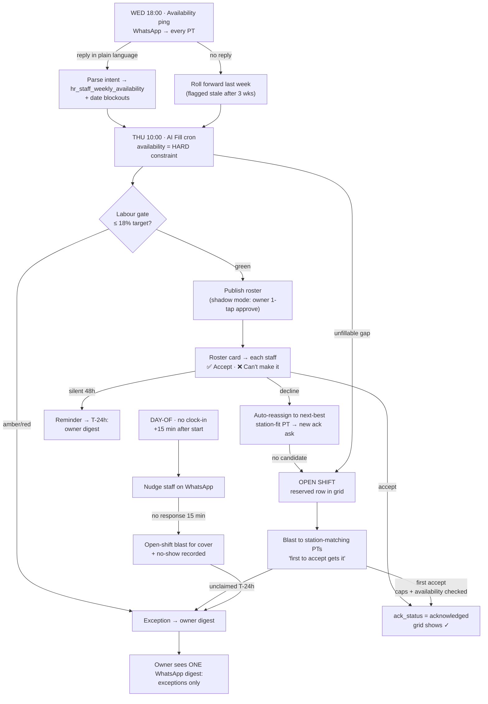

# PT Loop — autonomous part-timer scheduling over WhatsApp

The owner rule this implements (2026-07-17): *"the direction is there — no human
will do this."* Availability capture → AI Fill → roster acknowledgment → open
shifts → no-show cover, running on a weekly rhythm with WhatsApp as the staff
interface and ONE exception digest to the owner. Companion memo:
`pt-scheduling-sop-memo` (bilingual EN/BM, sent to all PTs before go-live).

## The weekly rhythm

## Stages and rules

### 1. Availability capture (Wed 18:00)
- WhatsApp template ping to every active PT. Replies are free-text BM/EN
  ("boleh Sabtu Ahad, weekday lepas 3") → parsed to per-weekday windows in
  `hr_staff_weekly_availability` + per-date blockouts in
  `hr_staff_availability`. The staff app gets an editor screen as fallback.
- Silence = last declaration rolls forward; flagged stale in the digest after
  3 weeks unrefreshed.
- Availability becomes a HARD filter in the generator's PT stage (it already
  hard-blocks in Assist ranking) — a PT is never suggested outside their
  declared windows.

### 2. Generate + publish (Thu 10:00 cron)
- AI Fill runs per outlet with the shared demand model; labour gate validates
  against the 18/20% budget. Green → publish. Amber/red → owner digest with
  the gate's reasons.
- Shadow mode first: the cron drafts and the owner approves with one tap.
  After N clean weeks (owner call), the approve step drops away.

### 3. Acknowledgment
- On publish, every rostered staff gets their week as a WhatsApp interactive
  card: **Accept** / **Can't make it** per shift (or whole-week accept).
- `hr_schedule_shifts.ack_status`: `pending → acknowledged | declined`.
  The grid shows ✓ / ⏳ / ✗ per cell.
- Decline → the shift auto-reassigns to the next-best station-fit PT (same
  ranking as Assist) and THAT person gets an ack ask. No candidate → the
  shift converts to an open shift.
- Reminders: T-48h unacked → nudge; T-24h → owner digest line. Late/frequent
  declines lower the PT's reliability score → fewer future offers (already
  wired via pt-performance).

### 4. Open shifts ("reserve empty spots")
- Sources: generator gaps no eligible PT could fill, orphaned declines,
  day-of no-shows.
- Stored in `hr_open_shifts`, shown in the grid as a reserved "Open · Middle 1"
  row so the hole stays visible instead of silently under-rostering.
- Blast to station-matching PTs (kitchen gap → kitchen-capable only), first
  accept wins; caps (24h/5-day combined), availability, and one-shift-per-day
  are enforced at claim time. Claim → real shift row, ack auto-set.
- Unclaimed at T-24h → owner digest.

### 5. Day-of enforcement
- No clock-in 15 min after shift start → WhatsApp nudge. No response in
  15 min → open-shift blast for cover + no-show recorded against
  reliability. Everything lands in the digest, nothing waits on a manager.

## Data changes (migration `pt_loop_ack_open_shifts`)
- `hr_schedule_shifts` + `ack_status` (`pending|acknowledged|declined`,
  default `pending`), `acknowledged_at`, `declined_reason`.
- New `hr_open_shifts`: outlet, date, window, station/role, status
  (`open|claimed|expired`), source (`generator|decline|no_show`),
  `claimed_by`/`claimed_at`, `expires_at`.
- New `hr_wa_prompts`: ledger of every outbound loop prompt
  (kind `availability|roster_ack|open_shift|no_show`, per-user, wamid,
  payload, response, responded_at) — idempotency for the cron, audit for
  the owner, training data for the parser.

## External dependency
- Meta template approval for outside-24h-session pings (availability ping,
  roster card, open-shift blast). Submit early; two-way replies inside a
  session ride the existing webhook with no approval needed.

## Build order
1. Migration + schema (this PR).
2. WhatsApp flows: roster-ack sender + webhook intents (accept / decline /
   availability parse) + prompts ledger writes.
3. Generator: availability hard-filter + emit `hr_open_shifts` for
   unfillable gaps; grid open-shift row + ack badges.
4. Staff-app availability editor + ack fallback.
5. Weekly cron (availability ping Wed, generate+publish Thu, reminders,
   day-of watcher) — folded into an existing cron dispatcher (Vercel cron
   cap), all agents registered in `agent_registry` with kill switches.

## Lessons
- (append as the build ships)
